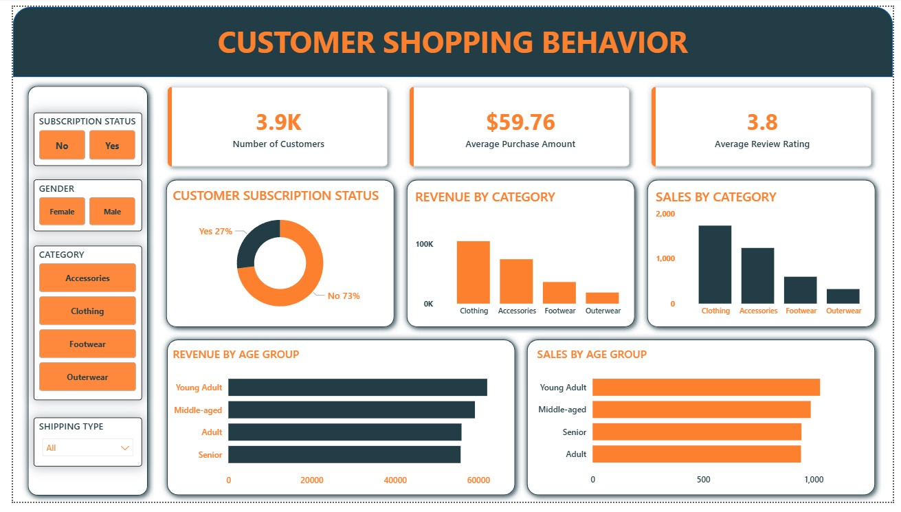

# Customer Shopping Behavior Analysis 📊

A data analysis project focused on understanding **customer purchasing patterns, spending habits, product preferences, discounts, and subscription behavior** using **Python, SQL, Excel, and Power BI**. The project combines data cleaning, SQL querying, exploratory analysis, and interactive dashboards to generate business insights.

## 🚀 Tools & Technologies
- **Python** – Data cleaning and analysis (Pandas, NumPy)
- **SQL (PostgreSQL)** – Data storage and querying
- **Excel** – Initial exploration and preprocessing
- **Power BI** – Dashboard creation and visualization

## 📌 Project Objectives
- Analyze customer spending behavior
- Compare purchase trends across demographics
- Study the impact of discounts and subscriptions
- Identify top-performing products and categories
- Segment customers based on purchase history
- Generate insights using SQL queries and visual dashboards

## 📊 Key Analysis Performed
- Revenue comparison by gender
- Customer spending analysis with discounts
- Top-rated and most purchased products
- Subscriber vs non-subscriber behavior
- Shipping type purchase comparisons
- Customer segmentation (New, Returning, Loyal)
- Revenue contribution by age group
- Repeat buyer and subscription analysis

## 📂 Dataset
The dataset contains information related to:
- Customer demographics
- Purchase amounts
- Product categories
- Ratings and reviews
- Discounts applied
- Subscription status
- Shipping preferences
- Purchase history

## 📈 Dashboard Insights
Interactive Power BI dashboard includes:
- Revenue trends
- Customer segmentation
- Product performance analysis
- Spending behavior visualizations
- Subscription and discount impact analysis

## 📊 Dashboard Preview

### Overview Dashboard


## 🛠️ Setup
1. Clone repository:
```bash
git clone https://github.com/jai-kesarwani/Customer-Shopping-Behavior-Analysis
```

2. Install dependencies:
```bash
pip install pandas sqlalchemy psycopg2-binary matplotlib
```

3. Run analysis notebooks and connect to PostgreSQL.

4. Open Power BI dashboard for visualization.

## 🎯 Outcome
This project provides actionable insights into customer shopping behavior, helping understand purchasing trends and factors influencing customer spending.

---

## 👨‍💻 Author

**Jayy**

Passionate about **Data Analysis, Python, SQL, Power BI, and building impactful projects.**

---

## ⭐ If you found this project useful, consider giving it a star!
